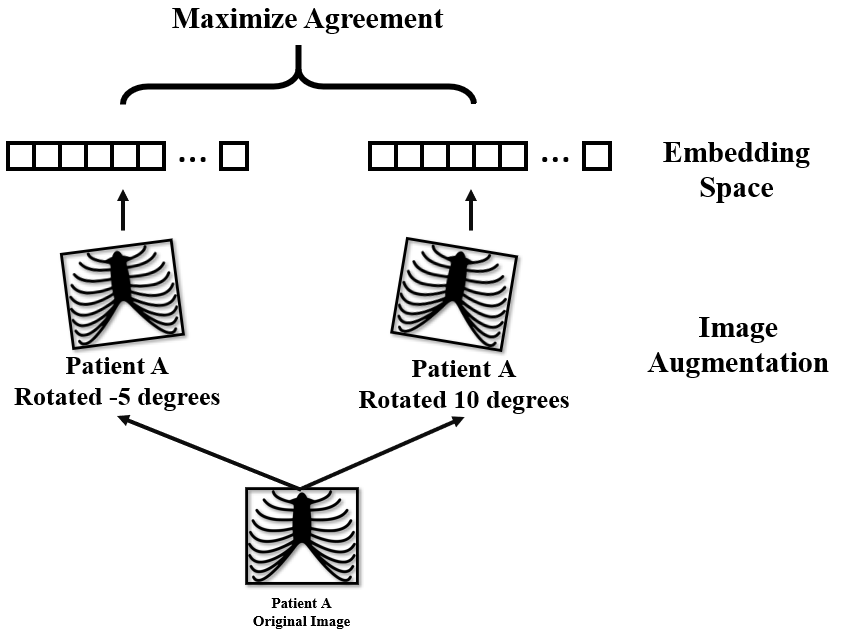
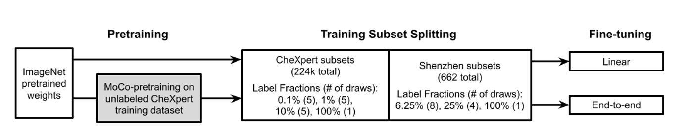
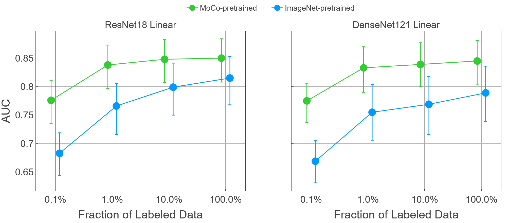
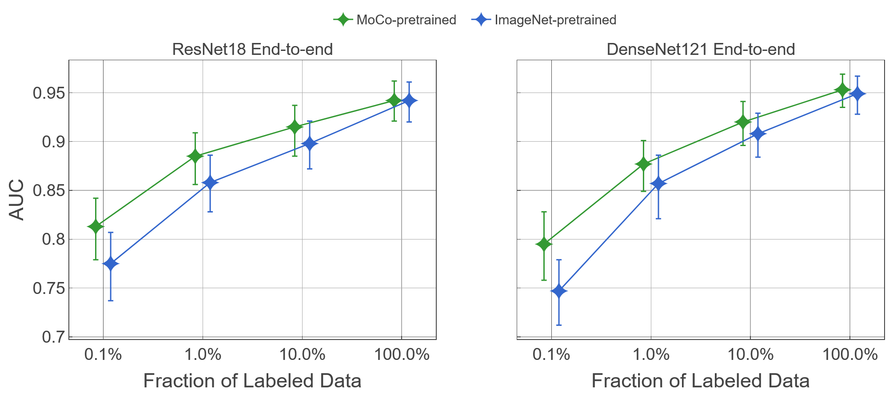

# MoCo-CXR: MoCo Pretraining Improves Representations and Transferability of Chest X-Ray Models

This repository contains
* A modified version of [the MoCo paper](https://github.com/facebookresearch/moco) to accomodate for the CheXpert dataset
* A modified version of the original implementation of [the CheXpert paper](https://arxiv.org/pdf/1901.07031.pdf)

Preprint of this work is available on [arXiv](https://arxiv.org/pdf/2010.05352.pdf)
```
@article{sowrirajanmoco,
  title={MoCo-CXR: MoCo Pretraining Improves Representation and Transferability of Chest X-ray Models},
  author={Sowrirajan, Hari and Yang, Jingbo and Ng, Andrew Y and Rajpurkar, Pranav}
}
```

This work has been presented in
* ACM Conference on Health, Inference and Learning (CHIL 2020) workshop
* Medical Imaging with Deep Learing (MIDL 2021)

## Abstract
```
Contrastive learning is a form of self-supervision that can leverage unlabeled data to produce pretrained models. While contrastive learning has demonstrated promising results on natural image classification tasks, its application to medical imaging tasks like chest X-ray interpretation has been limited. In this work, we propose MoCo-CXR, which is an adaptation of the contrastive learning method Momentum Contrast (MoCo), to produce models with better representations and initializations for the detection of pathologies in chest X-rays. In detecting pleural effusion, we find that linear models trained on MoCo-CXR-pretrained representations outperform those without MoCo-CXR-pretrained representations, indicating that MoCo-CXR-pretrained representations are of higher-quality. End-to-end fine-tuning experiments reveal that a model initialized via MoCo-CXR-pretraining outperforms its non-MoCo-CXR-pretrained counterpart. We find that MoCo-CXR-pretraining provides the most benefit with limited labeled training data. Finally, we demonstrate similar results on a target Tuberculosis dataset unseen during pretraining, indicating that MoCo-CXR-pretraining endows models with representations and transferability that can be applied across chest X-ray datasets and tasks.
```

## Methods

MoCo-CXR uses momemtum contrast as an unsupervised training method. This method maximizes agreement between augmentations of the same images while increases distances with the momemtum-weighted negative embedding.



MoCo-CXR is based on ResNet initialize weights, then trained in an unsupervised manner. Supervised learning is performed on different label fractions for the CheXpert dataset and the Shenzhen dataset.




## Evaluation

Comparison of MoCo-CXR performance against ResNet initialized baseline when only the linear layers are fine tuned.



Comparison of MoCo-CXR performance against ResNet initialized baseline when all layers are allowed to be tuned.



## Checkpoints
* https://storage.googleapis.com/moco-cxr/mnn-00001.pth.tar
* https://storage.googleapis.com/moco-cxr/r8w-00001-v2.pth.tar  (slightly different but produces similar result as V1)
* https://storage.googleapis.com/moco-cxr/r8w-00001.pth.tar
* https://storage.googleapis.com/moco-cxr/r8w-0001.pth.tar
* https://storage.googleapis.com/moco-cxr/r8w-001.pth.tar
* https://storage.googleapis.com/moco-cxr/r5w-00001.pth.tar
* https://storage.googleapis.com/moco-cxr/d1w-00001.pth.tar

Note that these checkpoints follow MoCo's implementation. To re-use them for ImageNet-like training process, you will have to "hack" the checkpoint weights using ways similar to our [model saver](https://github.com/stanfordmlgroup/MoCo-CXR/blob/main/chexpert_supervised/chexpert-model/saver/model_saver.py).

## Running the experiments

### Pre-Training
Note that the above naming includes "dot", that is, 00001 means 0.0001=1e-4. 
Our experiments are conducted on Stanford's SLURM. For reference, the training script used is [here](https://github.com/stanfordmlgroup/MoCo-CXR/blob/main/moco_pretraining/scripts/training_scripts/r8w1n416.sh). Alternatively, if you are runng it on a "vanilla" machine, you can refence [this script](https://github.com/stanfordmlgroup/MoCo-CXR/blob/main/moco_pretraining/scripts/training_scripts/sbatch_moco_train_local.sh). You could also referene [a generation script](https://github.com/stanfordmlgroup/MoCo-CXR/blob/main/moco_pretraining/scripts/generate_moco_training_scripts.py) if you would like to generate commands for different learning rate and/or backbone model.

### MoCo-CXR Training with CheXpert

We used splitting scripts like [this](https://github.com/stanfordmlgroup/MoCo-CXR/blob/main/moco_pretraining/scripts/reorganize_files.py) to split data into traininig and validation sets. These also generate the various draws to produce confidence interval for evaluation of our semi-supervised approach. 

For the Shenzhen dataset, we used [this](https://github.com/stanfordmlgroup/MoCo-CXR/blob/main/moco_pretraining/scripts/convert_to_chexpert.py) to convert the unpacked Shenzhen files into CheXpert's default format for easier experiment setup. Note that the actual CheXpert pipeline is a 3 step process, training, model picking (select best checkpoint) and evaluation. Each independent "draw" went through this process. 

## Additional Information

* [Shenzhen dataset](https://qims.amegroups.com/article/view/5132/6030)
* [CheXpert leaderboard](https://stanfordmlgroup.github.io/competitions/chexpert/)
* [CheXtransfer](https://www.chilconference.org/proceeding_P11.html)
* [CheXternal](https://www.chilconference.org/proceeding_P12.html)
* [VisualCheXbert](https://www.chilconference.org/proceeding_P10.html)
